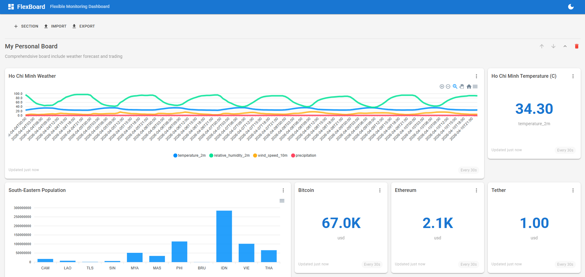

# FlexBoard — Flexible Monitoring Dashboard

A real-time monitoring dashboard web application that displays dynamic charts
from any public JSON API. Built with .NET 8, Blazor WebAssembly, MudBlazor,
and ApexCharts.



## Quick Start

1. Clone the repository
2. `dotnet run --project src/FlexibleMonitoringDashboard`
3. Open `http://localhost:5125` in your browser
4. Add a section → Add a chart → Paste any JSON API URL → Done!

## What Makes FlexBoard Unique

Unlike traditional monitoring platforms that require complex setup, data pipelines, or vendor lock-in, FlexBoard offers:

- **Zero-Config Data Sources** — Paste *any* public JSON API URL and start charting immediately. No adapters, no plugins, no SDKs.
- **Smart Chart Suggestions** — The built-in `ChartTypeRecommender` analyzes the shape of your JSON data (arrays, scalars, time-series) and automatically picks the best chart type. No guesswork needed.
- **Cross-Source Correlation** — Overlay data from two completely unrelated APIs on a single dual-axis chart (e.g., Bitcoin price vs. weather temperature).
- **JSON Config Export/Import** — Your entire dashboard is a single portable JSON file. Share it via email, commit it to Git, or load it on another machine — instant reproducibility.
- **Threshold Alarms** — Set value-based alerts on any chart. When a data point crosses your threshold, the widget visually highlights the breach in real time.
- **No Database, No Auth Required** — Runs anywhere with `dotnet run`. All state lives in the browser with optional JSON file persistence.

## Features

- **Universal URL Connector**: Paste any public JSON API URL, auto-detect fields, render instantly
- **Smart Chart Suggestions**: Automatic chart type recommendation based on data structure
- **Cross-Source Correlation**: Overlay data from two APIs on one dual-axis chart
- **JSON Config Export/Import**: Save and share dashboards via JSON configuration files
- **Threshold Alarms**: Get notified when values cross configured thresholds
- **Beautiful UI**: Material Design with dark/light theme, responsive layout

## Try It Out

Import the example dashboard to see FlexBoard in action:

1. Run the project: `dotnet run --project src/FlexibleMonitoringDashboard`
2. Open `http://localhost:5125`
3. Click **Import** → select [`docs/examples/my-dashboard.json`](docs/examples/my-dashboard.json)
4. The dashboard loads with live weather data from Ho Chi Minh City, Southeast Asian country population data, and cryptocurrency prices.

**Example API — Ho Chi Minh City Weather (Line Chart):**
```
https://api.open-meteo.com/v1/forecast?latitude=10.823&longitude=106.6296&hourly=temperature_2m,relative_humidity_2m,wind_speed_10m,precipitation&forecast_days=7
```

## Documentation

- [Product Overview & Architecture](docs/architecture.md)
- [User Guide](docs/user-guide.md)
- [Configuration Schema Reference](docs/configuration-schema.md)
- [Example Dashboard Config](docs/examples/my-dashboard.json)
- [AI Assistance Logs](docs/ai-assistance/)

## Tech Stack

| Layer | Technology |
|-------|-----------|
| Frontend | Blazor WebAssembly (.NET 8) |
| UI | MudBlazor (Material Design) |
| Charts | Blazor-ApexCharts |
| Backend | ASP.NET Core Minimal APIs |
| Tests | xUnit + Moq |

## License

MIT
